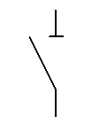
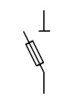
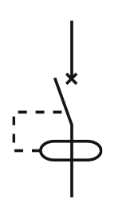
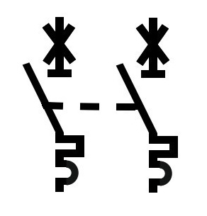
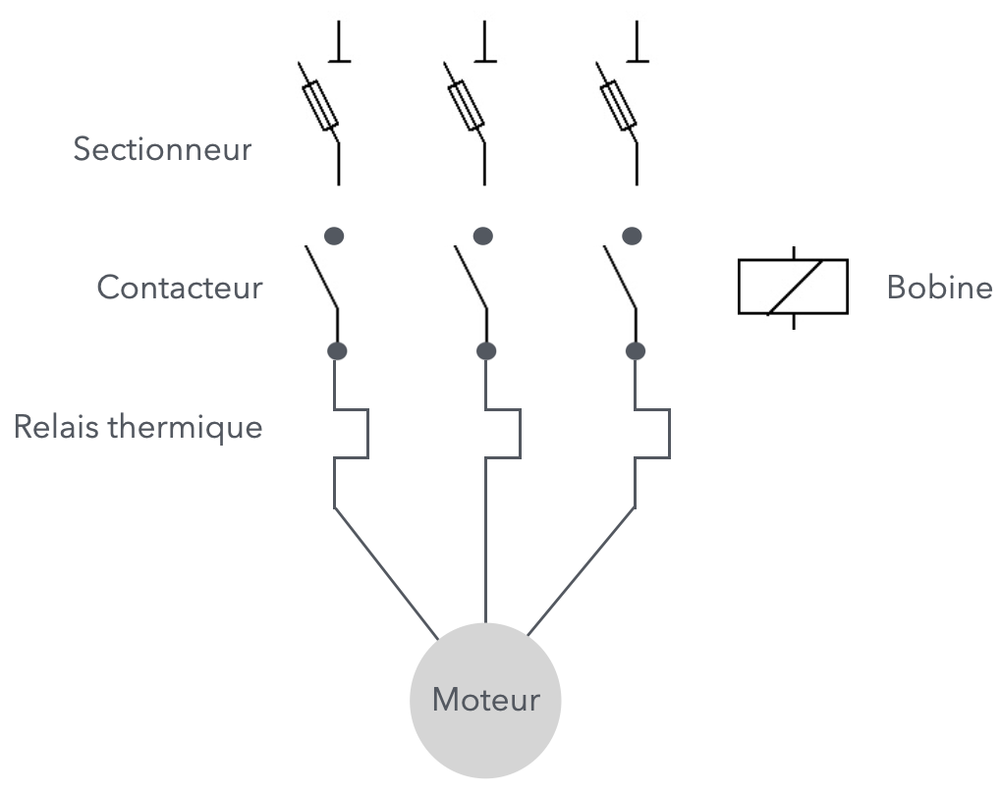
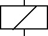

# CAP 1.73 Indus 1 : protections & commandes
## Foley Services Elec - [Programme 2ème partie](../2eme_partie/README.md)

### 1.73 Indus 1 : protections & commandes

- **Accès à la vidéo** [1.73 Indus 1 : protections & commandes](https://youtu.be/E8TSs---Z_Q)

#### Sectionneur, interrupteur, disjoncteur

- Un sectionneur  peut sectionner un circuit ***hors charge***
  - Sectionneur à fusible 
  - En industriel, on utlise les fusibles aM (associé moteur) (plutôt que les fusibles gg "général")
- Un interrupteur différentiel  peut interrompre en charge, mais supporte une faible intensité
- Un disjoncteur  peut disjoncter alors qu'il est en charge, et supporte une forte intensité

--

- Le sectionneur est utilisé pour ouvrir le circuit qui alimente une machine, par exemple, avant d'intervenir sur l'appareil.
  - Ses fusibles protègent contre les courts-circuits
- Mais il ne protège pas contre les surcharges. Il faut alors utiliser des ***relais thermiques***.
  - Ceux-ci se greffent souvent aux contacteurs (de même marque)
- Les contacteurs sont actionnés à l'aide du mécanisme d'une bobine 
  - Il existe des bobines 230V, 400V, 24V, 12V, et même pour courant continu, il faut choisir la bobine qui convient
  - Il existe des contacteurs avec délais (temporisateur), contacteurs délai-repos (delay off) ou délai-travail (delay on); le contacteur ferme le circuit lorsqu'on appuie sur un bouton-poussoir (par exemple), puis après avoir relâché le bouton, le contact n'ouvrira le circuit qu'après un certain délai
- Il faut utiliser un disjoncteur moteur, à régler selon les spécifications du moteur.

- La connexion entre l'alimentation, le montage des protections et le moteur se fait à l'aide de bornes viking.
- Les commmandes sont actionnées à l'aide de bouton de différents formats et de différentes couleurs
  - Rouge (stop ou danger), vert (en marche), jaune (attention), etc.