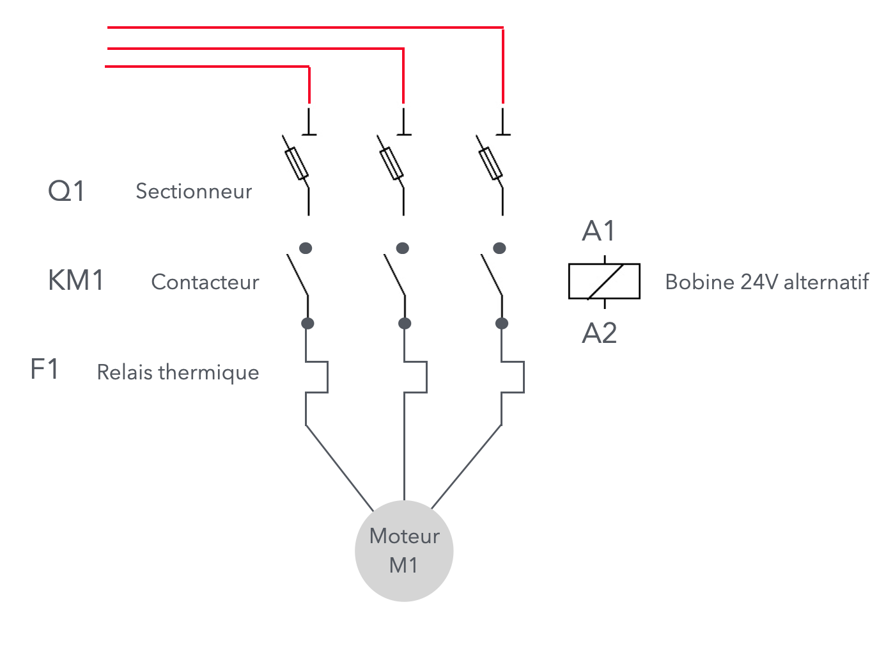
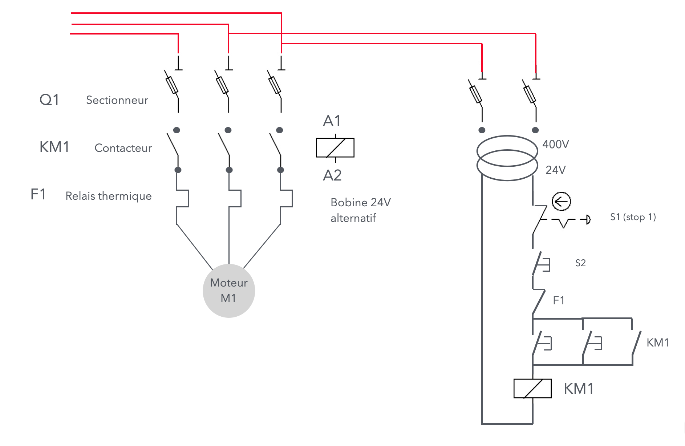

# CAP 1.74 Indus 2 : démarrage directe
## Foley Services Elec - [Programme 2ème partie](../2eme_partie/README.md)

### 1.74 Indus 2 : démarrage directe

- **Accès à la vidéo** [1.74 Indus 2 : démarrage directe](https://youtu.be/anSNjzBhB5g)

#### Circuit de puissance moteur, circuit de commande

[On a déjà exposé le circuit de puissance du moteur, avec explication du rôle de chaque composante protégeant le circuit.](./CAP_Elec_1_73.md)

Le circuit de commandes est alimenté en repiquant depuis une ou deux phases en amont du circuit de puissance.

Les commandes - pour des raisons de sécurité (risque de contact direct) - fonctionnent souvent sous une tension de 24V. Il faut donc utiliser un transformateur qui nous fait passer de 400V à 24V

- Le transformateur créée un appel de courant relativement fort au démarrage, il faut donc protégéer le circuit à l'aide d'un sectionneur à fusible sur chacune des phases.
- On protège avec des fuisibles de 4A, si par exemple le transformateur a une puissance de 240W (puisque $240 W \geq 400V \cdot 4A = 1600W$.
  - On peut par exemple, utiliser un *disjoncteur courbe D*, qui peut supporter pendant un certain temps, quelques millisecondes, une charge ou une intensité nominale plus importante dès la mise en marche de certains appareils (plus consommateurs d’électricité au démarrage). Si l’appel de charge perdure, le disjoncteur courbe D se déclenche pour jouer son rôle de protection.

- Le contact KM1 (contact moteur) est opéré depuis des boutons poussoir connectés en parallèle
  - S'y ajoute un un contact (en parallèle avec le sboutons poussoirs) qui maintient le dispositif en marche, un contact qui ferme le circuit qui restera fermé même après avoir relâché les boutons poussoirs
- On ajoute au dispositif des boutons pour arrêter le moteur, des *contacts qui sont normalement fermés* (et qui ouvriront le circuit dès qu'ils sont activés)
  - Contact coup de poing (S1 = stop 1)
  - Bouton poussoir normalelent fermé (S2)
  - Contact qui peremt d'ouvrir les relais thermiques du circuit de puissance (F1, en référence au nom attribué aux relais thermiques)

#### Circuits TBT (très basse tension)

(vidéo = 18' 18")

