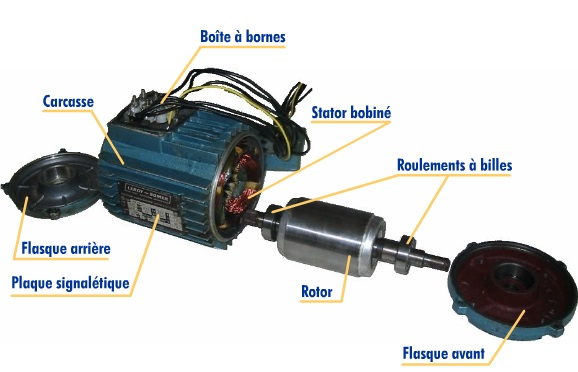
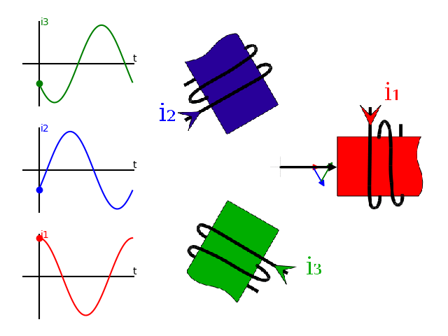
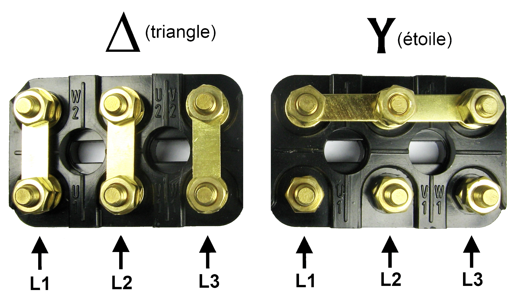

# CAP 1.75 Indus 3 : moteur asynchrone
## Foley Services Elec - [Programme 2ème partie](../2eme_partie/README.md)

### 1.75 Indus 3 : moteur asynchrone

- **Accès à la vidéo** [1.75 Indus 3 : moteur asynchrone](https://youtu.be/xz1XHJVTQSA)

Les bases -- beaucoup (95% - 97%) des moteurs sur le marché sont de ce type.

#### Moteur asynchrone - starter

Il se présente sous la forme d'un cylindre contenant *trois bobinages*.

- Pour chaque bobine, on aa deux fils qui sont ramenés au niveau d'un boitier de connexion monté sur le moteur.
- Dans le boitier arrive aussi les trois phases, et la terre.

Ces composants forment le *stator*. L'autre patie est le *rotor*.

- Il n'y a aucune connexion électrique entre le stator et le rotor.

- Les bobines du stator sont disposées dans le cylindre, formant deux à deux un angle de 120 degrés, chaque bobine étant connectée à l'une des phases.

Voir l'animation complète [sur le site de Charles Joubert (enseignant IUT Lyon)](https://perso.univ-lyon1.fr/charles.joubert/web_anim/sim_rotfield_create.html)

---

Le boitier de branchement du moteur contient, outre la liaison à l aterre, six points de connexions qui se présentent comme deux rangs de poitns opposés: $u_1, v_1, w_1$ et $u_2, v_2, w_2$.

Les spécifications du moteur indique la tension que doivent recevori les bobines. On doit alors se référer au réseau pour savori si cette tension est disponible, et si elle correspond à la tension entre phase et neutre ou entre deux phases.

On convient de brancher les bobines "en quinconces", c'est-à-dire aux points $u_1$ et $v_2$, $v_1$ et $w_2$, $w_1$ et $u_2$.

Ces cas déterminent si le branchement des bobines du moteur doit se faire en configuration "étoile" (avec le centre de l'étoile qui correspond au neutre), ou en triangle.

- Avec une connexion en étoile, on connectera le sphases aux points $u_1, v_1$ et $w_1$
  - les points opposés des branchements seront solidarisés à l'iade d'une barrette et connectés au neutre
- Avec une connexion en triangle, on connectera les phases aux points $u_1, v_1$ et $w_1$ (pas de neutre)
  - les points de connexion seront solidarisés à l'aide de trois barrettes, $u_1$ avec $u_2$, $v_1$ avec $u_2$, $w_1$ avec $w_2$.
