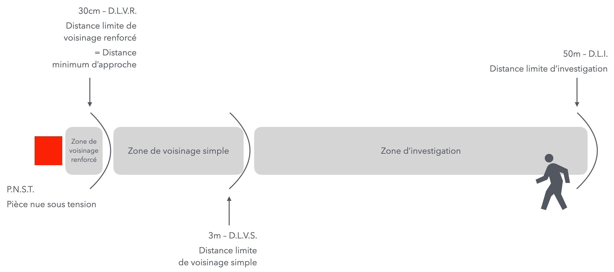

# CAP Elec 1.79 Habilitations élec. introduction
## Foley Services Elec - [Programme 2ème partie](../2eme_partie/README.md)

### 1.79 Habilitations électrique - Introduction

- **Accès à la vidéo** [1.79 Habilitations élec. introduction](https://youtu.be/pe7i9GkI_H4)

L'habilitation s'obtient par une formation en présentiel sur 3 jours (ou plus) totalisant un minimum de 21 heures de formation.

Quelques chiffres à avoir en tête:

- 10mA = *seuil de non lâcher*
- *résistance du corps humain* (en milieu sec) = 5000 $\Omega$
- U = RI $\rightarrow$ 5000 $\Omega \cdot \frac{10}{1000} A = 50V$, qui est la *tension limite de sécurité*

- partant de cette tension limite de sécurité de 50V, prenant aussi en compte la sensibilité la moins favorable des équipoements protecteurs, soit 500mA au niveau de l'AGCP, on trouve:
  - $R = \frac{U}{I} = \frac{50V}{0.5A} = 100 \Omega$

#### Contact direct ou indirect

***Contact direct***: contact avec une pièce mise sous tension

***Contact indirect***: contact avec une pièce qui ne devrait pas se trouver sous tension (le plombier qui touche un tuyau qui est anormalement sous tension)

***Pièce nue sous tension*** (P.N.S.T.): 

- Nue: défini par rapport aux indices de protection IP
  - IP2X : référence au doigt, peut-on toucher avec le doigt (12.5mm) une pièce sous tension ? (IP1X = 5cm)
  - En BT (basse tension), une pièce (sous tension) est considérée nue si elle n'est pas IP2X.
  - En HTA (haute tension), une pièce (sous tension) est considérée nue si elle n'est pas IP3X (on ets IP3X si la pièce n'est accessible qu'avec un objet de 2.5mm ou moins, typiquement un tournevis)

- Eloignement des équipements, protection IP2X etc. protègent des contacts directs
- Les dispositifs différentiels, prise de terre, le S.L.T. (schéma de liaison à l aterre, anciennement appelé "régime de neutre") protègent des contacts indirects.

#### Risque d'incendie

...

#### Domaines de tension

Les domaines de tension sont divisés selon l'intervalle $[0, 50, 1000, 50000, \infty]$

- Basse (**B**) $\leq 1000V$
  - **TBT** très basse tension $< 50V$ ou **BT** basse tension $\geq 50 V$ et $< 1000 V$
- Haute (**H**) tension $> 1000V$
  - **HTA** $> 1000 V$ et $< 50K = 50000 V$ ou **HTB** > $50K V$

#### Travail ou intervention

- Travail: remplacemnet dun' dispositif cassé ou hors d'usage
- Intervention: modification d'une installation

**Travaux**

Nature

- **0** non-électriques
- **1** électriques (en tant que exécutant)
- **2** chargé de travaux électriques)

Attributs

- Voisinnage renforcé: à moins de 30cm d'un pièce sous tension
- N: nettoyage sous tension
- T: T.S.T. travaux sous tension
- X: exceptionnel

**Interventions**

- **C** chargé de consignation
- **P** PV photovoltaïque (couvreur qui installe du photovotaïque **BP**, intervention sur éolienne **HP**)
- **S** simple (plombier qui remplace un chauffe-eau, **BS**)
- **F** fouille (mini-pelle pour accéder aux câble senterrés **BF**)
- **R** chargé d'intervetion électrique (**BR** pour le dépannage: trouver le défaut, supprimer le défaut, remise en service)

Attributs

- Manoeuvre
- Mesure (**BE** Mesure, qui relève des tensions, facteur de puissance, ... sur des installations dans des musées, lieux publics, ...)
- Vérification
- Essai

#### En sortie de CAP Elec

- **B1V** électricien exécutant
- **BR** chargé d'intervention électrique (dépannage)
- **H0** pour pénétrer dans un local HTA (réservé aux électriciens)

#### Voisinnage simple, renforcé

Dans le contexte d'un champ libre, c'est-à-dire que la pièce sous tension se trouve dans une pièce où circule des personnes non habilitées,

- 30cm d'air correspond à une isolation contre une tension de 1000V

Dans le contexte d'un local réservé aux électriciens , c'est-à-dire que la pièce sous tension se trouve dans une pièce où circule des personnes non habilitées,

### Analyse de risques

Obligation employeur / Responsabilité employé

--

[Un bon résumé des habilitations et des sigles qui les désignent est accessible sur le site voltwork.](https://www.voltwork.fr/nf-c18-510/symboles-habilitation-electrique/)
