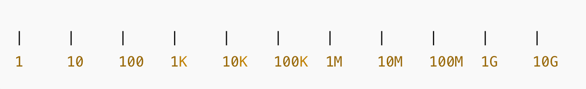

# CAP Elec 1.83 Mise en service cours
## Foley Services Elec - [Programme 2ème partie](../2eme_partie/README.md)

### 1.83 Mise en service cours

- **Accès à la vidéo** [1.83 Mise en service cours](https://youtu.be/wNK_aQaREA4)

#### Mise en service (domestique)

- Scénario retenu, installation tétra (petit tertiaire).
- La mise en service concerne un tableau électrique éventuellement conçu par un tiers.

- Tableau deux rangées (minimum deux interrupteurs différentiels en domestique)

#### Principes de l'exercice de mise en service

- Protection individuelle
  - (Habilitation BR chargé d'intervention)
  - Tapis d'isolation (au sol)

##### 1ère étape, VAT

|  *Précondition(s)* | *Mesure attendue*  | *Méthode de mesure* |
|---|---|---|
|  AGCP coupé, ***port des EPI avant d'ouvrir le tableau*** |  On doit mesurer 0V (aucune tension) | A l'origine du répartiteur (peigne vertical) |

- L'AGCP a été désactivé (coupure), puis consigné
- On vérifie à l'aide d'un appareil VAT que le tableau n'est pas sous tension: tension nulle entre neutre et phase(s), entre phase(s) et terre, entre neutre et terre.

Les mesures se font:

  - On teste l'appareil VAT
  - Au niveau du peigne (répartiteur), entre phase et neutre, entre phase et terre, entre neutre et terre
  - On re-teste l'appareil VAT
- Dès lors qu'on a établi que le tableau n'est pas sous tension, on peut enlever les équipements de protection

##### 2ème étape Mesures de résistance / Vérification de continuité de terre

|  *Précondition(s)* | *Mesure attendue*  | *Méthode de mesure* |
|---|---|---|
| n/a |  (Continuité de terre): 2 $\Omega$ maximum | Entre le répartiteur de terre et chacun des appareils qui doit être protégé |

***Mesure attendue*** (continuité de terre): 2 $\Omega$ maximum

- L'appareil qui lit la résistance (mesurée en $\Omega$ Ohms) fait entendre un bip si la résistance ne dépasse pas 40 Ohms (à vérifier selon les modèles), mais ***il faut en tous les cas pouvoir lire la valeur sur l'écran digital de l'appareil***.

"Il est impératif de vérifier la continuité des conducteurs de protection et des liaisons équipotentielles supplémentaires et principales éventuelles. Elles doivent être testées avec un ohmétre et leur continuité doit être inférieure ou égale à 2 ohms."

([tiré du site web Zoom Elec](https://www.schema-electrique.net/mise-a-la-terre-installation-electrique-norme-NF-C-15-100.html)) 

Les mesures se font:

- Entre le répartiteur de terre et chacun des équipements alimentés par un circuit du tableau
- Sans oublier les appareils de classe 2 pour lesquelles un fil de terre est en attente
- Pour les DCLs, on peut utiliser un connecteur DCL auquel on attache simplement un fil de terre

##### 4ème étape Vérification de l'isolement

(On voit la 3ème étape en suivant)

|  *Précondition(s)* | *Mesure attendue*  | *Méthode de mesure* |
|---|---|---|
| Tous les circuits fermés, contacteurs en marche forcée |  Résistance supérieure à 0.5M $\Omega$ | Une seule mesure en amont de tous els cricuits (au niveau du répartiteur, peigne vertical, par exemple) |

- Mesure de la qualité de l'isolation des conducteurs (en $\Omega$ Ohms aussi)
- On doit pouvoir mesurer des résistaces dans le domaine des Mega Ohms (milliers de $\Omega$), avec un appareil, le *méga-ohmètre*

L'appareil est en capacité de lire des résistances élevées, variant de 10K $\Omega$ à 10G $\Omega$

- On injecte dans un réseau 230V, une tension de 500V, dans une installation 500V on injectera une tension de 1000V
- Pour une très basse tension, on utilisera une tension de 250V
- L'usage de l'appareil ne nécessite pas l'utilisation des EPI
  - L'appareil n'est pas relié au réseau
  - Il n'injecte un courant électrique que de 1mmA (or le seuil de non lâcher est de 10mmA).

|  Tension nominale du circuit | Tension d'essai  | Résistance minimale d'isolement  |
|---|---|---|
|  Inférieur à 50 V |  250 VDC |  0,25 M $\Omega$ |
| De 50 V à 500 V  |  500 VDC |  0,50 M $\Omega$ |

Pour tester l'isolement, on pourrait tester individuellement chacun des départs de circuit (et on doit observer pour chacun  une résistance d'au moins 0,5M $\Omega$).

On va plutôt considérer l'ensemble des circuits, tous à la fois -- qui sont alors en parallèle. [On se rappelle que la résistance d'un circuit parallèle est plus petite que la résistance la plus faible des circuits qui sont connectés en parallèle.](../1ere_partie/CAP_Elec_1_03.md)

- Ainsi, si la résistance mesurée est au moins égale à 0,5M $\Omega$, c'est qu'elle est au moins égale à cette valeur pour chacun des circuits.

Cette vérification se fait en s'assurant d'abord que tous les circuits sont fermés (tous les disjoncteurs sont "en marche forcée"), que tous les contacteurs sont aussi en marche forcée (contacteur chauffe-eau, par exemple).

##### 3ème étape Vérification d'absence de court-circuit

|  *Précondition(s)* | *Mesure attendue*  | *Méthode de mesure* |
|---|---|---|
| Tous les circuits ouverts, contacteurs en marche forcée |  $\infty$ (OL over limit, ou afffichage équivalent selon modèle d'appareil de mesure) | En aval de chacun des disjoncteurs protégeant un circuit | En aval de chacun des disjoncteurs protégeant un circuit |

Avec le test décrit à la section précédente, on ne vérifie pas l'isolement entre phase et neutre.

Pour mesurer la résistance entre phase et neutre, on pourrait procéder circuit par circuit.

Les mesures se font:

- Commandes en marche forcée (contacteur à "ON")
- Circcuit ouvert (Interrupteur à "OFF") 

- En principe, la mesure doit afficher  $\infty$ (OL over limit) puisqu'il n'y a pas continuité entre phase et neutre (sauf en cas de court-circuit).
  - Cependant, il peut y avoir continuité sur certains appareils s'ils étaient en marche avant que l'on coupe l'alimentation (au niveau de l'AGCP)
  - Si de tels cas se présentent et qu'il y a effectivement continuité entre phase et neutre, le multi-mètre indiquera la résistance (non-nulle) des appareils alimentés par ce circuit.
  - Alors qu'un court-circuit affichera une résistance nulle (ou très petite, en deça de la résistance d'un appareil)

##### 5ème étape Vérification de tension***"s"***

|  *Précondition(s)* | *Mesure attendue*  | *Méthode de mesure* |
|---|---|---|
| *En fin de quatrième étape, les circuits sont remis en position "ouverts" ("OFF")* ***Port des EPI avant remise sous tension (AGCP à "ON")*** |  230V si on est en monophasé | Plusieurs points de mesure |

Première mesure au niveau du répartiteur entre phase et neutre

- On doit obtenir 230V
- Mais on n'est pas assuré qu'il n'y a pas eu inversion de phase et de neutre
  - On s'en assure en mesurant la tension entre phase et terre, neutre et terre

##### 6ème étape Mise sous tension progressive***"s"***

|  *Précondition(s)* | *Mesure attendue*  | *Méthode de mesure* |
|---|---|---|
| *En fin de cinquième étape, on peut refermer le capot*, ce qui autorise à se libérer des EPI |   |  |

Dans le tableau, rangée par rangée:

- Enclenchement de l'interrupteur différentiel
- Test de l'interrupteur différentiel
- Ré-enclenchement de l'interrupteur différentiel

-- (Fin partie mise en service installation domestique monophasée, [un peu avant à 1h 6m dans la vidéo](https://youtu.be/wNK_aQaREA4?t=1h6m))