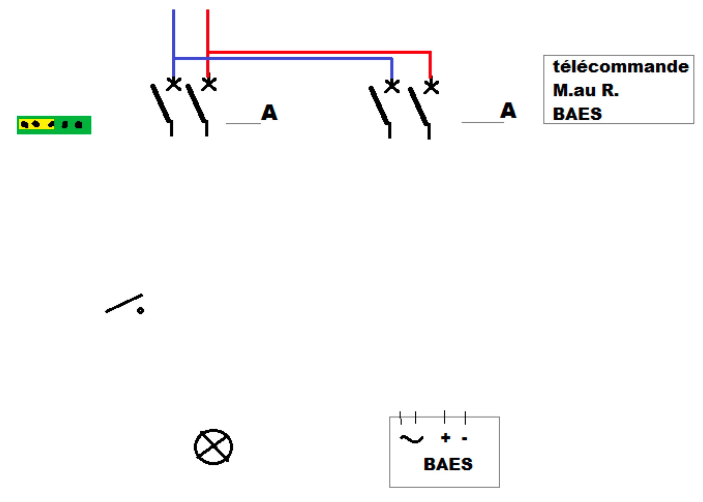

# CAP Elec
## Foley Services Elec - [Programme 2ème partie](CAP Elec.md)

### 1.59 QCM Questionnaire Eclairage de Sécurité

[Le corrigé de ce QCM](./1.59 BAES corrigé.pdf)

Nom et Prénom	:	Date :

1. Il faut compter combien de temps pour charger un BAES ?

   A. 1 hr

   B. 2 hr

   C. 4 hr

   D. 6 hr

   E. 8 hr

2. Un BAES doit s’éclairer pendant combien de temps en cas de coupure?

   A. 1 hr

   B. 2 hr

   C. 4 hr

   D. 6 hr

   E. 8 hr

3. BAES veut dire:

   A. Bloc automatique évacuation sécurité

   B. Bloc autonome d’éclairage de sécurité

   C. Batterie automatique d’éclairage de sécurité

   D. Batterie autonome d’éclairage sécurisée

   E. Bloc auto d’évacuation sécurisé
   

4. Les BAES bas installés dans un parking doivent être posés à quelle hauteur maximum:

   A. 20 cm

   B. 35 cm

   C. 50 cm

   D. 70 cm

   E. 80 cm

5. Il faut installer les BAES dans un couloir tous les changements de direction:

   A. 15 m ou changement de direction

   B. 20 m ou changement de direction

   C. 25 m ou changement de direction

   D. 20 m

6. La télécommande sert à:

   A. Charger les blocs

   B. Tester les blocs

   C. Empêcher les blocs de décharger pendant des travaux

   D. Tester ou charger les blocs

   E. Connaitre l’état des blocs

7. 	Il faut alimenter la télécommande avec le même disjoncteur que l’éclairage

   A. Oui

   B. Non

   C. Peu importe

   D. La télécommande n’est pas alimentée (il y a une pile)

   E. La télécommande n’est pas obligatoire


8. Un BAEH doit éclairer (minimum):

   A. 1 hr

   B. 2 hr

   C. 4 hr

   D. 6 hr

   E. 8 hr

9. Le LED de signalisation d’un BAES SATI qui n’a pas été complètement chargé, mais en bon état:

   A. Est vert fixe

   B. Est vert avec clignotement

   C. Est orange

   D. Est orange avec clignotement

   E. N’est pas allumé

10. Complétez le schéma avec SA, lampe, et éclairage de sécurité

