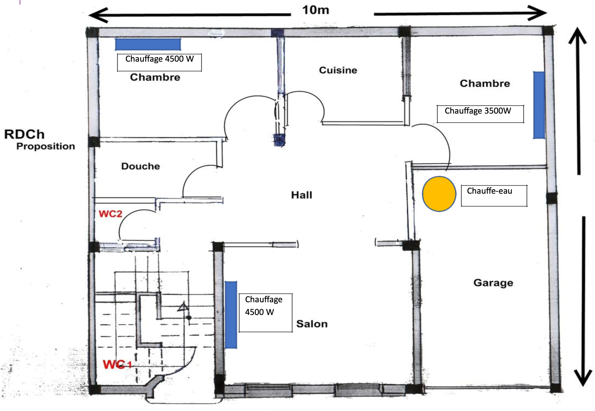
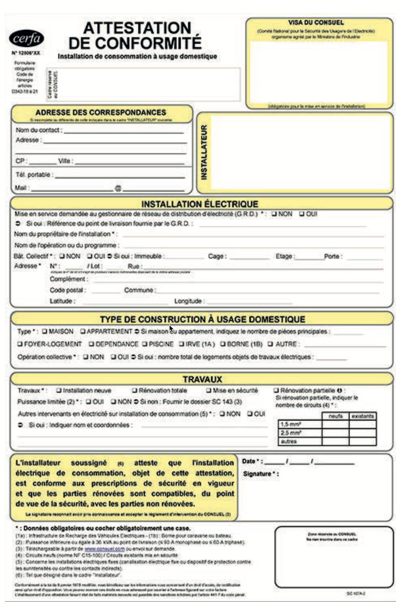

# CAP Elec
## Foley Services Elec - [Programme 2ème partie](CAP Elec.md)

### 1.68 CONSUEL

[Le corrigé de ce QCM](./1.68 CONSUEL & diagnostic corrigé.pdf)

Nom et Prénom	: 	Date. 

#### DIAGNOSTIC

Citez les 6 points contrôlés lors du diagnostic électrique (par exemple pour la vente d’une maison):

1.

2.

3.

4.

5.

6.

#### CONSUEL

1. L’attestation de conformité bleu est pour les installations:

  A. Habitation privé <36kVA

  B. ERT & ERP

  C. Production (exemple photovoltaïque)

  D. Production avec stockage d’énergie (batteries)

  E. Installation IRVE

2. L’attestation de conformité violet est pour les installations:

  A. Habitation privé <36kVA

  B. ERT & ERP

  C. Production (exemple photovoltaïque)

  D. Production avec stockage d’énergie (batteries)

  E. Installation IRVE

3. L’attestation de conformité vert est pour les installations:

  A. Habitation privé <36kVA

  B. ERT & ERP

  C. Production (exemple photovoltaïque)

  D. Production avec stockage d’énergie (batteries)

  E. Installation IRVE

4. L’attestation de conformité jaune est pour les installations

  A. Habitation privé <36kVA

  B. ERT & ERP

  C. Production (exemple photovoltaïque)

  D. Production avec stockage d’énergie (batteries)

  E. Installation IRVE

5. L’attestation de conformité IRVE est obligatoire pour:

  A. Toutes les installations IRVE

  B. Toutes les installations IRVE plus que 3.7kw

  C. Toutes les installations IRVE mois que 3.7kw

  D. Aucune installation IRVE (c’est optionnel)

  E. Toutes les installations IRVE en tri (22kw et plus)

6. Remplissez la demande de conformité CONSUEL basé sur le plan architectural suivant d’une maison en rénovation totale:

([Voir le document d'aide CONSUEL jaune](../docs/AIDE_ACONSUEL_ACJ.pdf))

