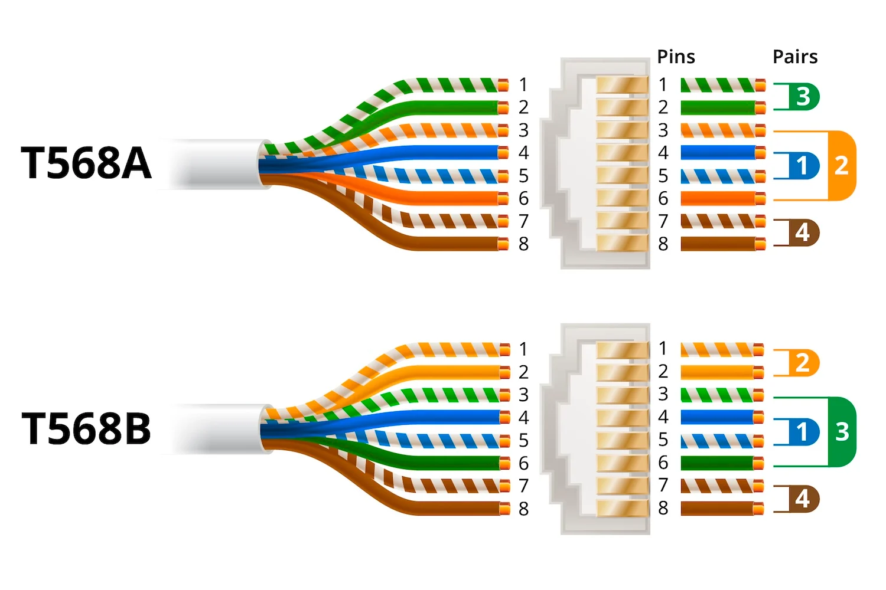

# CAP 2.16 Prise rj45 (1)
## Foley Services Elec - [Programme 3ème partie](../3eme_partie/README.md)

### 2.16 Prise rj45 (1)

- **Accès à la vidéo** [2.16 Prise rj45 (1)](https://youtu.be/dD8DHP3YA-I)

#### Connexions RJ45

Ouverture de la prise (petite languette), et il y a deux schémas de connexion 568A ou 568B

- Ces schémas indiquent comment les fils, selon des codes couleurs, correspondent aux différents "slots" de la prise.
- On insére les fils selon les codes couelurs (orange, blanc/orange, marron, blanc/marron, etc.)
  - Auparavant, on a supprimer les feuilles "alu", le plastique, et la tige plastique centrale après avoir écarter les paires de fils
  - Dans certains cas, il faut essayer de préserver les torsades
  - Dans d'autres cas, il faut tout "détorsader"
  - On prête attention au brin ("terre")
  - Astuce lorsqu'il est nécessaire d'insérer les fils dans des orifices, on découpen en diagonal pour faciliter leur insertion (!!! - [voir vidéo à 9'35''](https://youtu.be/dD8DHP3YA-I&t=9m35s))
- Les connecteurs appartiennent à des catégories (qui correspondent aux performances des connecteurs), catégorie 5 ou catégorie 6

Cas particuliers des fiches RJ45 qui utilisent du câble "***patch cable***".

- Il faut détorsader les fils, les ranger dans l'ordre (modèle T568B = le bleu/blanc et le bleu "entourent" le vert/blanc et le vert, le orange à une extrémité, les marrons à l'autre extrémité)

- On travaille les fils de manière à ce que la position soit maintenue au repos (pour faciliter l'insertion des fils dans la fiche)
  - On coupe de manière à avoir environ 8mm de fils, et on les insère dans la fiche. [Voir la vidéo à 18'](https://youtu.be/dD8DHP3YA-I&t=18m).
- Reste à utiliser une pince (parfois, selon le modèle de fiche) pour fermer la fiche et "pincer" les fils

