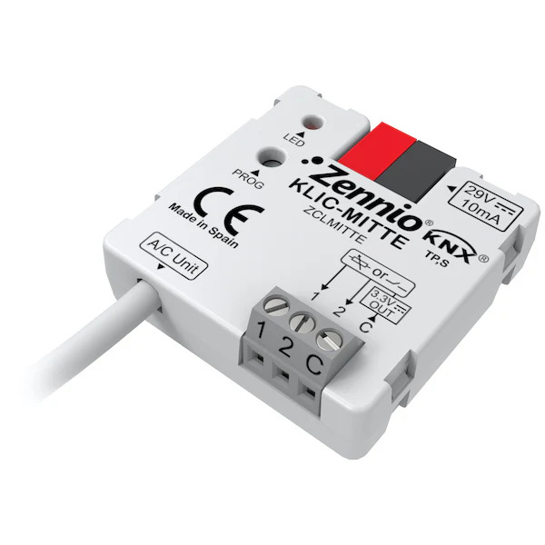
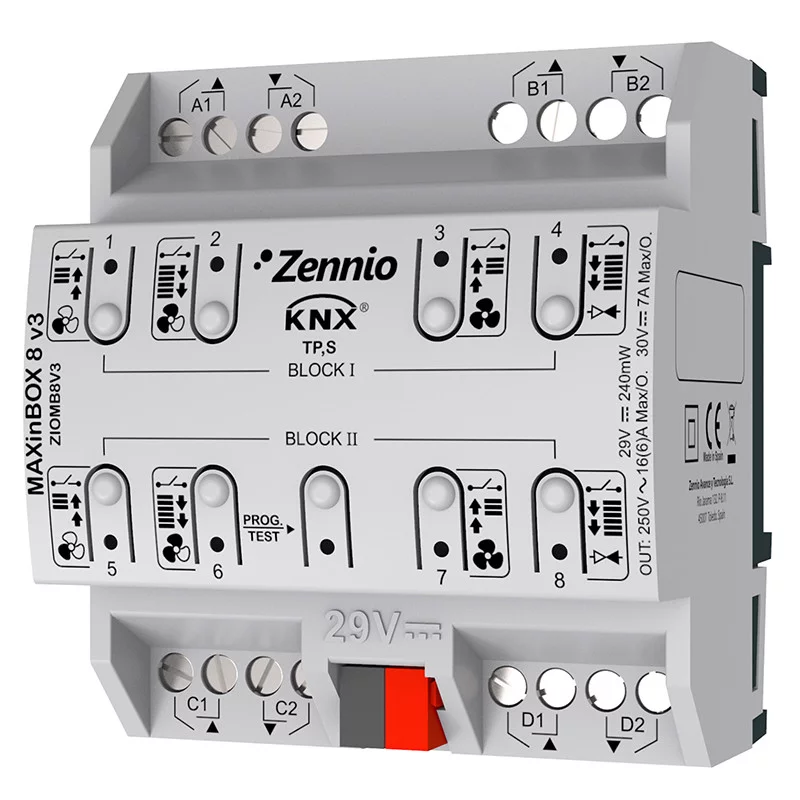
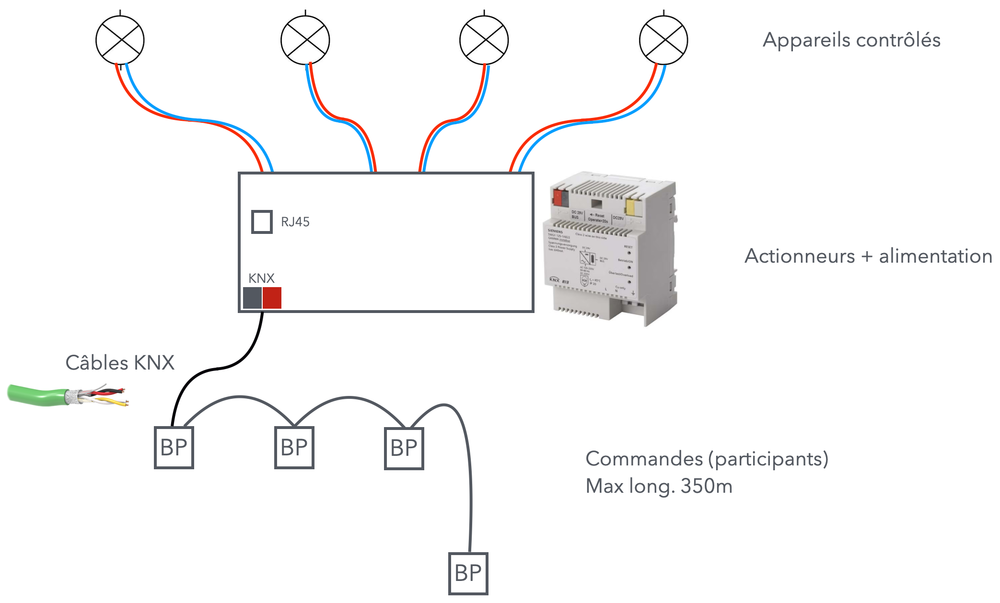

# CAP 2.24 KNX
## Foley Services Elec - [Programme 3ème partie](../3eme_partie/README.md)

### 2.24 KNX

- **Accès à la vidéo** [2.24 KNX](https://youtu.be/2ja5wV8K01g)

[KNX](https://fr.wikipedia.org/wiki/KNX_(standard)) est un protocole de transmission de données open-source.

Sur les appreils, on reconnait les connecteurs KNX à leur couleur Gris/Rouge

On distingue les commandes et les appareils qui sont contrôlés via le protocole KNX.

#### Actionneurs et commandes

On peut typiquement raccordés plusieurs éclairages sur un même ***actionneur*** KNX (2 sorties, ..., 8 sorteis, 16 sorties, ...)

Par exemple:

La prise RJ45 permet de connecter le module à une box internet, de manière à pouvoir communiquer avec l'actionneur à travers une application.
