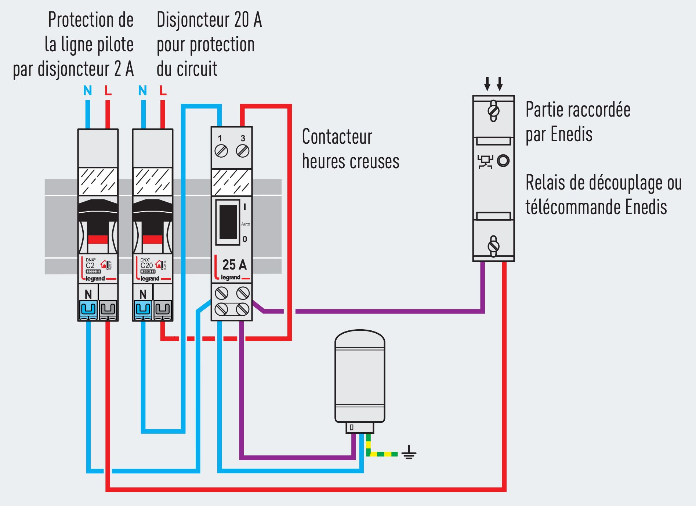
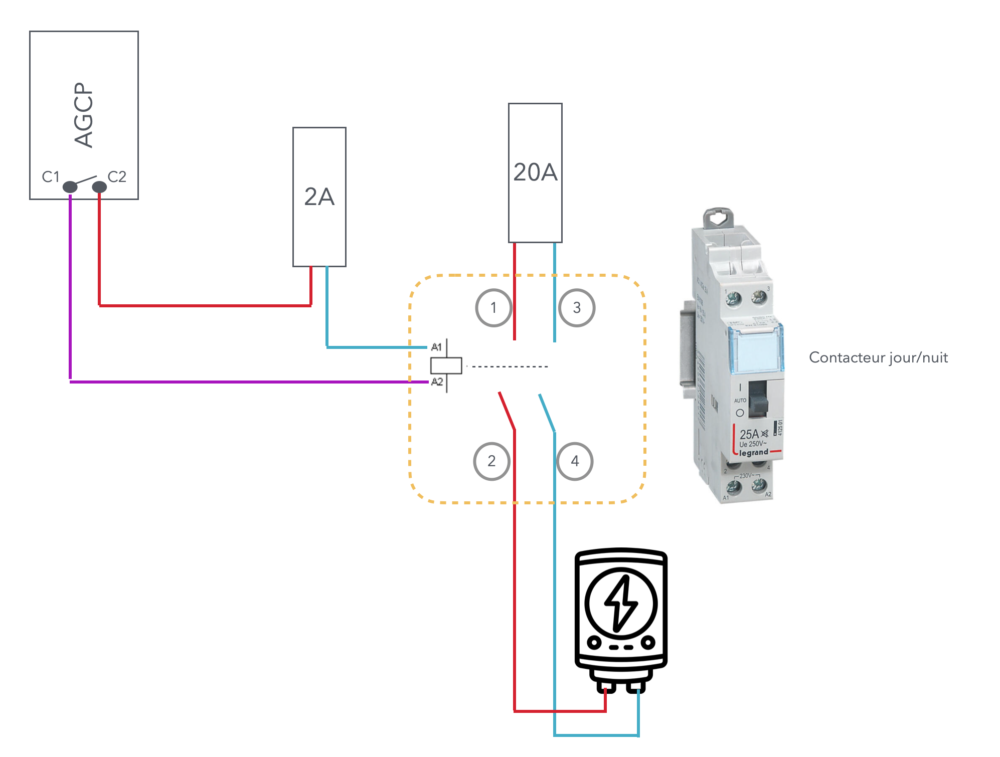
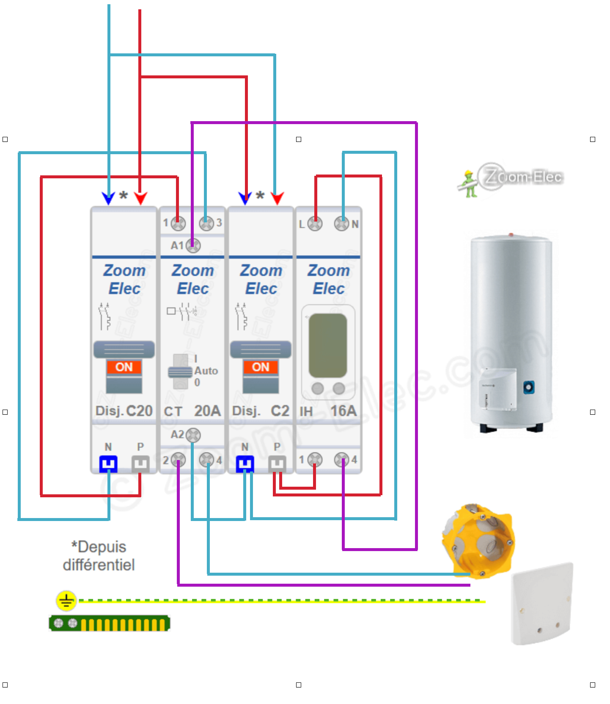

# CAP 2.25 Chauffe-eau
## Foley Services Elec - [Programme 2ème partie](../2eme_partie/README.md)

### 2.25 Chauffe-eau

- **Accès à la vidéo** [2.25 Chauffe-eau](https://youtu.be/giYwQs1e_nk)

#### Tableau, puissance, nombre de départs

- Chauffe-eau, disjoncteur 20A, section 2.5
- Le chauffe-eau est ***seul sur son circuit*** (si deux chauffe-eau en même temps, on passe à 32A, le disjoncteur saute), la norme l'exige
- On peut protéger le chauffe-eau par un interrupteur différentiel de type AC
- Il est interdit de brancher le chauffe-eau sur une prise d ecourant, les prises ne sont pas conçues pour être sollicitées sur la durée avec un courant de cette intensité (les prises sont plafonnés à 16A max pendant 2h max)
- Il est conseillé d'utiliser un domino, les wago ont tendance à chauffer

#### Contacteur jour/nuit

Préambule sur la production d'énergie par les centrales nucléaires, sur la consommation d'électricité plus élevée en journée que la nuit, sur la nécessité d'équilibrer cette consommation (pour éviter la perte d'énergie)

- Introduction du tarif jour/nuit et des dispositifs pour déclencher la consommation nuit
  - Ajout d'une onde de fréquence plus élevée 175Hz que la fréqence de 50Hz du flux électrique
  - Les compteurs comportent un récepteur 175Hz

L'AGCP est muni de deux bornes C1 et C2 correspondant à un contact qui se ferme lorsque le signal 175Hz est émis, à l'eure où débute le service en heures creuses (tarif moins élevé). L'idée est d'utiliser ce contact pour alimenter un dispositif (le contacteur) qui alimentera alors le chauffe-eau, qui se mettra en marche (en fonction du comportement du thermostat, par exemmple).

- Le contact C1/C2 doit être protégé par un disjoncteur 2A.
- Le contacteur est muni de six bornes:
  - A1, A2 qui correpsondent à la bobine actionnant le contact, et qui doit se fermer lors que le contact C1/C2 lui-même se ferme.
  - Deux bornes 1 et 3 où arrivent l'alimention du chauffe,eau, protégé en amont par un dijoncteur 20A
  - Deux bornes 2 et 4 qui amène l'alimentation vers le chauffe-eau dès que le contact C1/C2 se ferme (et donc lorsque la bobine du contacteur ferme les contacts du contacteur.

Vu différemment, 

#### Cas particulier: AGCP distant

Il peut se produire un cas particulier, celui où l'AGCP (appareil général de coupure et de protection) soit éloigné du tableau (habitation trop éloigné du PdL - point de livraison). On ne peut alors envisager de faire courir un fil pour utiliser le contact C1/C2 au niveau de l'AGCP.

On peut alors utiliser un contacteur horaire (et en le positionnant sur les horaires des tarifs heures creuses du client).

Le site [schema-electrique.net](https://www.schema-electrique.net/schema-cablage-branchement-interrupteur-horaire-chauffe-eau.html) explique clairement le principe du banchement de l'interrupetur horaire.

