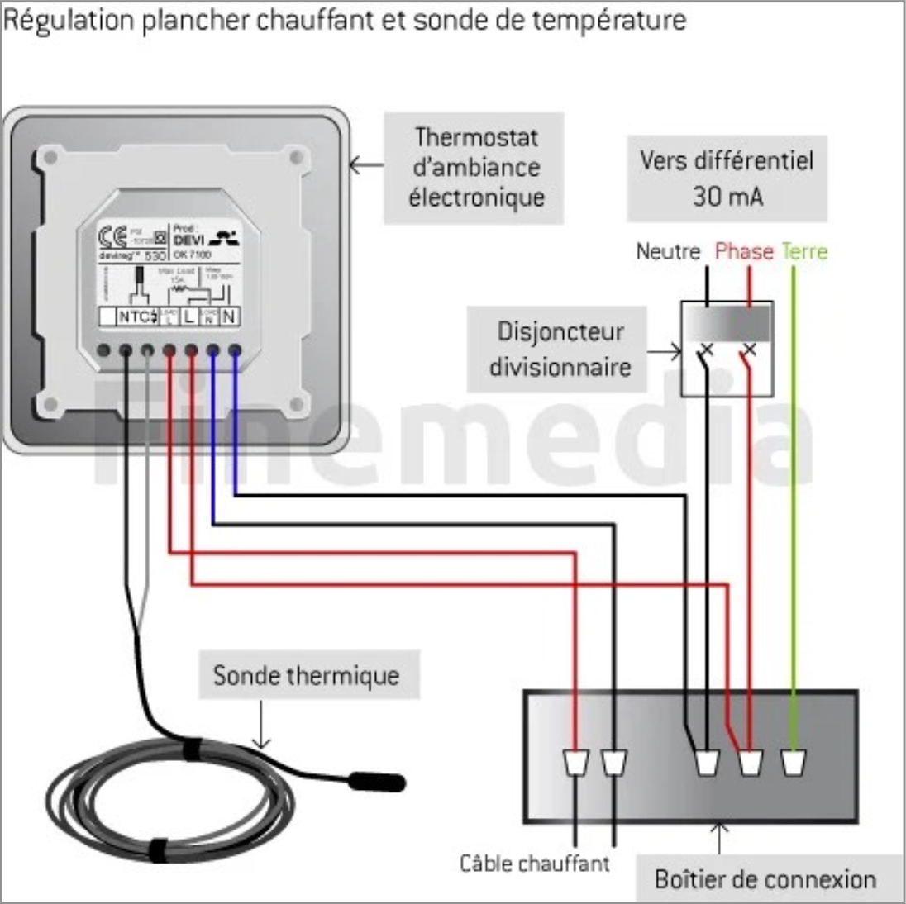
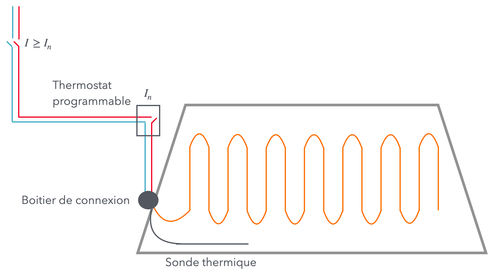

# CAP 2.26 Chauffage (sol et plafond)
## Foley Services Elec - [Programme 3ème partie](../3eme_partie/README.md)

### 2.26 Chauffage (sol et plafond)

- **Accès à la vidéo** [2.26 Chauffage (sol et plafond)](https://youtu.be/79TuG6X33qM)

Le chauffage va être traité en plusieurs parties:

- Chauffage au plafond
- Chauffage au sol
- Chaffage mural

#### Chauffage au plafond

Utilisation de "cassette", parfois intégrable au plafond suspendu. Gain de place.

Principe de chauffage comparé au soleil qui chaffe la terre, et la terre qui réfléchit la chaleur absorbée.

- Gestion du chauffage pièce par pièce.
- Peu utilisé en domestique.
- Exemple d'un chantier dans un école de Coutras.

#### CHauffage au sol

- Assez utilisé en domestique.
- Utilisation d'un primaire au sol (accroche) avant une couche de ciment-colle sur laquelle sera posé un isolant (polystryrène ?).
- On déroule sur l'isolant le chauffage (serpentin) - [voir la vidéo à 7'13''](https://youtu.be/79TuG6X33qM?t=7m13s).
- On fait arriver une sonde dans le sol (connectée au thermostat) pour éviter les problèmes de surchauffe. Il faut veiller à ce qu'elle soit bien entre les serpentins pour ne pas fausserla lecture de la température.

- Dans une pièce à vivre, on fait attention à ce pas chauffer là où se trouve les meubles.
  - C'est particulièrement le cas dans une cuisine.

**Branchement**

Il faut mesurer la résistance entre phase et neutre ***du câble chauffant*** pour s'assurer que la valeur correspond à la préconisation du fabricant.

- Il faut aussi mesurer entre phase/terre et neutre/terre et trouver au minimum 0.25 M$\Omega$ (méga Ohms).

- Le chauffage est ensuite recouvert, d'un carrelage ou d'un parquet flottant qui doivent être compatibles avec un chauffage au sol.

#### Thermostat

Un thermostat est un appareil qui a un contact (un simple allumage !)

- Intensité nominale $I_n$ (absorbée par le chauffage)
- Intensité maximale $I$ admise par le disjoncteur divisionnaire (qui protège le circuit)

**Cas où la puissance absorbée par le dispositif de chauffage n'excède pas la capacité du thermostat**, souvent 16A, soit 3500W (3680W très exactement).

**Cas où la puissance absorbée par le dispositif de chauffage excède la capacité du thermostat**, on doit alors utiliser un contacteur de puissance, le thermostat agissant comme simple contact protégé indépendamment (souvent par 2A, voire 10A).

[Voir aussi la vidéo de Plus 2 Rénovation](https://www.youtube.com/watch?v=3mQMaPlktqU) qui montre le détail de la connexion du thermostat Tybox 1117 de Delta Dore.