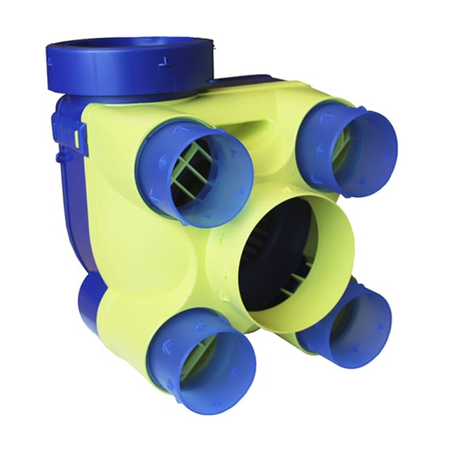
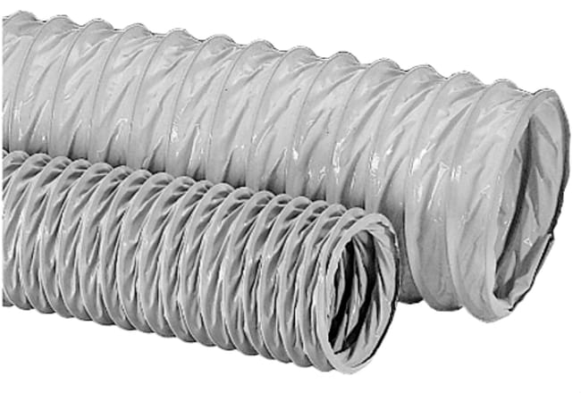
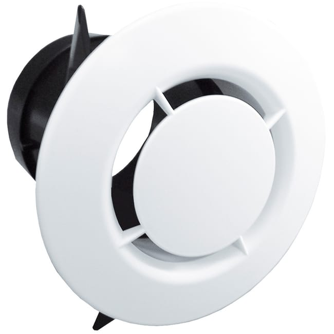
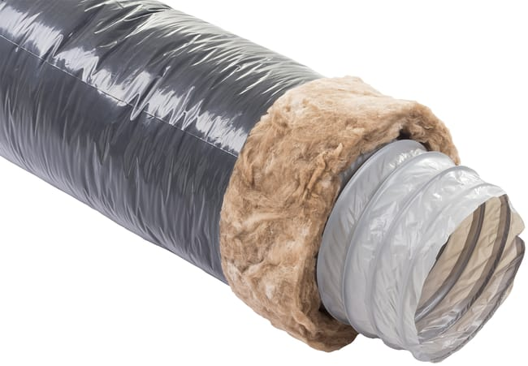
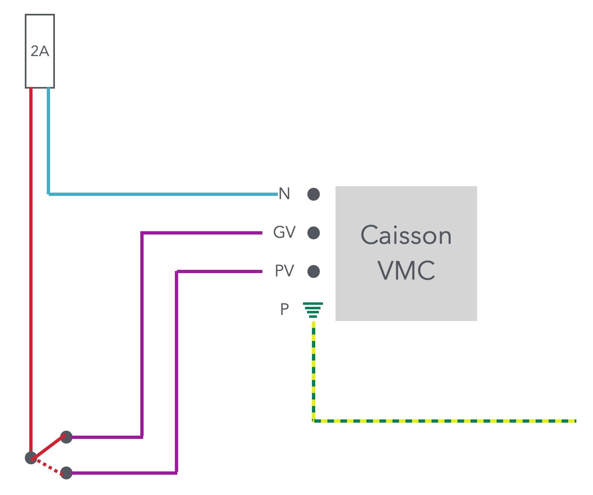

# CAP Elec 2.34 VMC
## Foley Services Elec - [Programme 3ème partie](../3eme_partie/README.md)

### Elec 2.34 VMC

- **Accès à la vidéo** [Elec 2.34 VMC](https://youtu.be/2PXk-sIaqbI)

#### Ventilation mécanique contrôlée (VMC)

L'objectif de la VMC ets de renouveler l'air d'une habitation, sachant que les maisons construites aujorud'hui sont plus étanches à l'air que ne l'étaient les anciennes habitations.

L'air contient naturellement environ 21% d'oxygène, celui que nous expirons n'en contient plus que 19%, d'où la nécessité de ce renouvellement. La présence de micro-particules à évacuer, voire de virus est aussi une autre raison qui pousse à ce renouvellement. Le maintient d'un bon niveau d'humidité, le dégagement d'air viscié.

##### VMC simple flux

Grilles d'aération au-dessus des fenêtres dans le schambres ou dans certaines pièces, laisse entrer de l'air frais (sans nécessairement utiliser de motorisation).

En revanche, on installe un système d'évacuation de l'air viscué dans les "pièces d'eau", avec pour chacune un débit cible:

| Pièce d'eau | Débit cible |
|-------------|-------------|
| Cuisine | 60 m3/h |
| sdb | 30 m3/h |
| WC | 15 m3/h |
| cellier | 15 m3/h |

La solution simple flux, une approche déjà ancienne, est une solution simple pour éviter les problèmes d'humidité, par exemple, mais présente le désavantage d'avoir un effet opposé au système de chauffage (dit autrement, on expulse de l'air qui a été chauffé, et uinduit donc un coût énergétique important).

L'équipement consiste en:

- un caisson de ventilation 
- gaines permettant d'aspirer le flux depuis différentes pièces 
  - diamètre 80mm ou 125mm
- bouches standard (d'arrrivée de la vmc dans la pièce) 
- 1 disjoncteur 2A (par VMC) (normé)
- Section 1.5
- Différentiel type AC, coefficient 0.5

##### VMC simple flux hygro

- Bouches équpées de capteurs d"humidité qui règle l'ouverture en fonction du taux d'humidité
- gaines isolées de laine de verre pour éviter la perte de chaleur et la condensation 

Il existe des gaines rigides et "plates", utilisées surtout lorsque les gaines ne sont pas accessibles.

Il existe aussi des extracteurs d'air (voir auter vidéo).

##### VMC double flux

Pour éviter les pertes d'énergie (évacuation d'air chaud), la VMC double flux fait agir un échange thermique pour que la chaleur de l'air expulsé soit utilisé pour réchauffer un flux d'air entrant.

Remarque. Le coût d'une VMC double flux, coût initial et coût récurrrent (changement de la cartouche qui filtre l'air entrant), n'est pas nécessairement amorti par les économies d'énergie qu'amène le dispositif.

##### Cablâge

La VMC admet deux positions, petite vitesse et grande vitesse. ON aura donc un interrupteur qui présente deux positions (PV et GV),

##### VMC et chauffe thermo-dynamique

L'air expulsé par la VMC, qui ets donc chaud, est acheminé vers le chauffe-eau qui va en extraire des calories pour chauffer l'eau. Le chauffe-eau doit alors être compatible avec une VMC.

##### Remarques

1. Les VMC simple flux ou double flux utilisée en domestique ne peuven têtre utilisées dans le tertiaire qui exige un caisson métallisuqe et des gaines rigides métalliques (galva).
2. Un électricien a usuellement une assurance qui l'autorise à déplacer les tuiles d'une toiture pour, typiquement, accéder aux comopbles et faire son intervention, car il ne s'agit alors pas d'une modification de la toiture.
  - Cependant, son assurance ne couvrira pas son intervention si elle induit une modification de la toiture.
