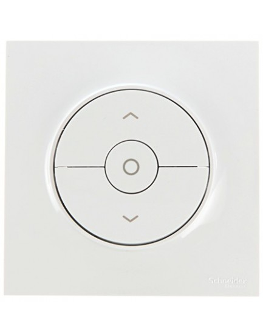
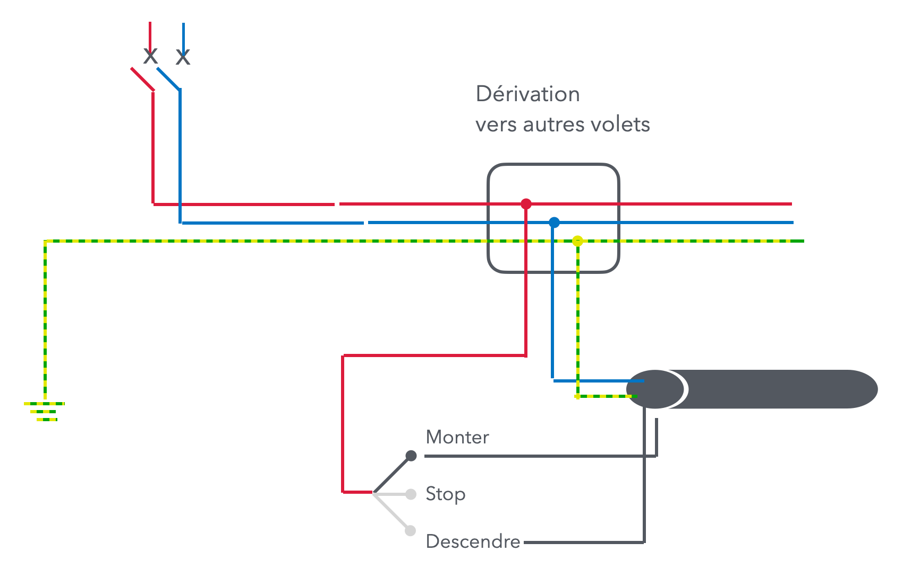

# CAP Elec 2.35 Colonne montante
## Foley Services Elec - [Programme 2ème partie](../2eme_partie/README.md)

### 2.35 Motorisations volets roulants

- **Accès à la vidéo** [2.35 Motorisations volets roulants](https://youtu.be/ECKjn2T1bYo)

#### Volets roulants

Dans le contexte d'une installation domestique.

- Câblage volets roulauts: section 1.5
- Par conséquent, disjoncteur 16A maximum, 10A recommandé car motorisation des volets souvent plafonné à cete intensité
- Nombre de volets sur un même circuit, dépend de la puissance des volets roulants
  - La puissance d'un volet "moyen" tourne autour de 300W pour une baie vitrée, 180W pour celui de la cuisine, 120W dans les chambres ..., ce qui permet de loger 2300W = 230V * 10A / 230W, soit jusqu'à une dizaine de volets sur un même circuits.
  - On peut souhaiter mettre les volets sur deux circuits pour éviter que tous les circuits soient bloqués si le circuit est en panne.

  
##### Câblage commande filaire d'un volet roulant

- Les bornes du volet roulant
  - Terre - branché à la terre du volet
  - Neutre - branché au neutre du volet
  - Monter
  - Descendre

La phase ne va donc pas au volet directement.

- La commande (au mur, près du volet) ets un interrupteur qui comporte trois positions.

- La pahse va vers cettte commande, qui ensuite sont connectées aux bornes ("Monter" et "Descendre") du volet roulant

--

Existe aussi en mode "sans fil".

- On installe un récepteur radio, un boitier qui reçoit les 4 fils: phase, neutre, monter, descendre.
- On synchronise ce boitier avec une ou des télécommandes qui permettent d'actionner le volet roulant.

--

Important, **en mode fillaire**, on ne peut pas monter deux mloteurs sur une même commande (problème de condensateurs).

On doit parfois initialiser les positions fin de course (volet ouvert, volet fermé).

--

Certains volets roulants sont déjà en mode radio, suffit alors d'amener phase et neutre sans se préoccuper des contrôles monter/descendre.

--

La leçon se termine en discutant de la problématique de synchronisation de commmandes avec les volets des zones nuit/jour, et de la nécessité de procéder à une deconnexion/connexion (à l'alimentation) -- mais cela ne peut pas se faire depuis le disjoncteur des volets puisque celui-ci déconnecte tous les volet set pas seulemnt ceux  de la zone nuit ou jour ...