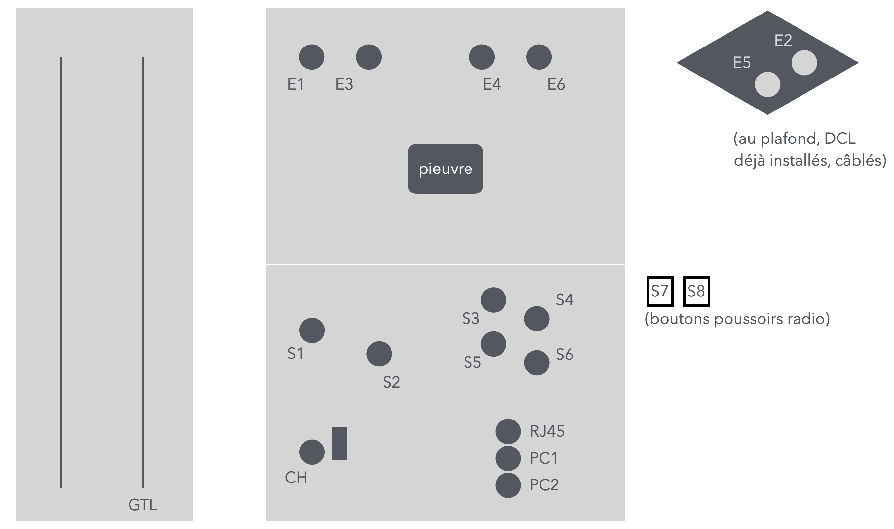

# CAP Elec - ÉPREUVES PRATIQUES session 2025

## Epreuves pratiques - Témoignage

Ce compte-rendu est rédigé au lendemain des épreuves pratiques EP1, EP2 et EP3 session 2025 des candidats libres sur l'académie de Bordeaux.

- L'épreuve EP1 consiste à réaliser une installation électrique
- L'épreuve EP2 consiste à lamise en service de l'installation réalisée la veille
- L'épreuve EP3 consiste à effectuer une opération de maintenance sur cette même installation électrique

Le compte-rendu est rédigé de mémoire, les candidats ne sont pas autorisés à "sortir" les documents du site où se passent les épreuves.

Au départ de chacune des épreuves, il faut prendre connaissance de deux documents: le document de travail (la copie de l'étudiant où sont reportées des réponses à des questions) et un document "ressources" qu'il faut consulter  totu au long de l'épreuve.

Il importe de savoir prendre connaissance de ces documents rapidement et de ne pas traîner à relever les informations dans le document ressource. En particulier, pour l'épreuve EP1, le temps indicatif d'une heure pour consulter les documents est en réalité long, il faudrait pouvoir le faire plus rapidement pour gagner ce temps sur la réalisation, qui elle prend beaucoup de temps.

### Epreuve EP1 Réalisation - 8 heures

On nous décrit un scénario qui donne le contexte de la réalisation. Dans le cas de mon épreuve, le contexte importait peu. Il s'agissait d'installer des éléments d'éclairage (E1 à E6), deux prises de courant, une prise RJ45, un chauffage et un volet roulant dans un appartement (logement de fonction) situé au-dessus d'une école.

(Encore une fois, je décris de mémoire, il y a certainement des imprécisions.)

Le document ressource décrit ce qui est attendu, et fournit un schéma en situation de l'habitation, chambre, salle de bain, salon/cuisine, une entrée. Il fallait:

- Installer un chauffage dans la chambre, commander par un dispositif radio [Delta Dore RF 6600 FP](https://www.deltadore.fr/domotique/gestion-chauffage/accessoires/recepteur-radio-fil-pilote-rf6600-ref-6050561)
- Installer une commande par poussoir d'un volet roulant (S6, je crois), mais aussi commandé par un dispositif radio [Delta Dore 5630](https://www.deltadore.fr/domotique/pilotage-volets-store-portail-garage/micromodule-recepteur/tyxia-5630-ref-6351401)
- Installer une commande S1 double-éclairage (salon/cuisine) E1, E2
- Installer une double prise de courant + prise RJ45 dans la cuisine (?)
- Un détecteur de mouvement S5 pour commander l'éclairage de l'entrée, avec interrupteur intégré pour forcer la marche de l'éclairage E5
- Un double bouton poussoir pour commander les éclairages E3 et E4
  - Avec, au niveau du tableau un télérupteur [Delta Dore 3940](https://www.deltadore.fr/domotique/pilotage-eclairage/micromodule-recepteur/tyxia-3940-ref-6351429) qui fait radio aussi
- Encore un autre éclairage commandé par un dispositif radio [Delta Dore Tyxia 5610](https://www.deltadore.fr/domotique/pilotage-eclairage/micromodule-recepteur/tyxia-5610-ref-6351400)
- (Et j'avoue ne plus me souvenir de l'éclairage E6, je n'ai pas eu le temps de temps de faire cette partie de la réalisation)

Pour la réalisation, on se retrouve dans un box face à une plaque de BA13

- Sur une plaque côté gauche du box, une GTL qui attend le tableau et les câbles/gaines. 
- Une partie de l'installation est déjà en place: partie haut de la plaque du fond, et deux éclairages au plafond.
- On intervient sur la partie basse de la plaque du fond pour l'installation  des autres éléments.
- Sur la partie haute, au centre, une boite de dérivation reçoit tous les cablages des éclairages et commandes, et le câble qui alimentera ces appareils, tous sur un même circuit.

On nous fournit le tableau (et un tableau de comunication pour la prise RJ45), un interrupteur différentiel et des disjoncteurs divisionnaires. Il n'y a pas d'AGCP, le moment venu le tableau sera alimenté directement depuis l'interrupteur différentiel.

#### Documents de travail et "ressources"

Les documents de travail/ressources précisent les emplacements des appareillages. Il précise aussi les différents circuits de l'installation

- Q1 Prises de courant
- Q2 Chauffage
- Q3 Volet roulant
- Q4 Eclairage

Le document ressource comprend un schéma multifilaire de l'installation.

Certaines informations à relever dans le document de travail concernent (de mémoire):

- Sur la sécurité et santé au travail: "Quelles sont les consignes à rappeler aux équipes sur le chantier ?",
- Sur les habilitations: "Qui sont les individus habilités, et quelles sont leurs habilitations, à intervenir sur le chantier, pour la consignation, pour la réalisation ?"
- On nous indique que le patron de l'entreprise ne nous a pas communiqué les spécifications des cablages reçu par la pieuvre, il faut les reconstituer (à partir de données partielles).
  - Il faut indiquer la couleur des fils insérés dans les gaines (ne pas oublier la terre !), leur section
  - pour les câbles, il faut indiquer leurs spécifications complètes, pas seulement 3G2.5 par exemple, mais bien avec 3G2.5 U1000R2V
- On nous demande de préciser l'ordre d'exécution du chantier, en 9 étapes, depuis le perçage des emplacements des boites d'encastrement, le passage des gaines et des conducteurs et/ou des câbles, la connexion des appareillages, ..., et jusqu'au montage des éléments du tableau dans le GTL
  - Les étapes sont indiquées dans le désordre, il faut donner le bon ordre. C'ets en quelque sorte un piège, plus loin dans le document la liste ordonnée apparait (je n'avais pas vu, j'ai perdu de précieuses minutes à reconstituer, à douter, etc.)

#### La réalisation

Puis, il faut y aller. On monte l'installation. Le temps est compté.

On nous donne des consignes sur l'utilisation des cable,s fils, gaines, connecteurs (wagos), etc. Une partie de l'évaluation repose sur la bonne utilisation de ces ressources (pas trop de chutes) - c'est un peu contradictoire avec la demande d'éviter d'utiliser des longueurs trops courtes pour qu'elles soient réutilisables dans d'autres TPs ...

Pour tout faire dans les temps, on n'a pas droit à l'hésitation. Les documents suggère d'effectuer tous les perçages, puis le passage de toutes les gaines, puis la connexion des appareillages, etc. ce que j'ai fait.

En fin de chantier, on doit avoir refermé la boite de dérivation, les appareillages (pots DCL, etc.), mis les plaques sur les prises et interrupteurs, fermé les tableaux (électrique et de communication), nettoyé le box, avant de rendre compte du chantier au patron qui passe pour savoir si tout est fait ou pas (échange oral avec l'évaluateur).

#### Mon ressenti sur l'épreuve

Attention, c'est le ressenti d'un apprenant qui a suivi un cours à distance, a travaillé sur une petite maquette maison, a effectué des travaux d'aménagement chez lui, et a travaillé quelques semaines avec un professionnel, donc avec peu d'heures sur le terrain.

Je n'étais pas à l'aise à travailler avec la pieuvre, ce qui rend difficile sa bonne gestion pour arriver à une boite de dérivation bien organisée (facile d'accès pour la maintenance). Dans le cas de cette épreuve, il aurait fallu avoir une meilleure compréhension du circuit d'éclairage, de la bonne manière de procéder pour organiser la boite.

Il aurait fallu passer plus de temps à étudier le schéma multifilaire -- à supposer qu'on ait suffisamment l'habitude de lire ce type de schéma -- avant de se lancer pour monter l'installation. Cela dit, je redoutais le montage de ce circuit, j'ai donc commencé avec les éléments plus faciles pour me mettre à l'aise avec l'épreuve.

- Prises PC1 et PC2, facile
- Prise RJ45, toujours un peu énervant à installer, mais facile aussi (pas eu le temps d'installer la prise à l'autre bout dan sle tableau de communication)
- Chauffage, facile aussi
- Volet roulant, ok mais j'ai été surpris et piégé par le module Dekta Dore 5630, j'ai pas compris de suite qu'il était opéré à la fois par radio ***et*** par bouton poussoir
- L'interrupteur double pour les éclairages, faciles aussi
- J'ai pas compris de suite pour le télérupteur Delta Dore, j'avais pas capté le double emploi de ces dispositifs radio et câblé ... (je n'en avais jamais installé)

IL ne faut pas hésiter à questionner les évaluateurs qui sont parès tout d'une bienveillance remarquable. Le mot d'ordre est "n'hésitez pas à nous questionner", même si parfois la réponse sera "tout est dans les documents".

En conclusion, la remarque majeure est que l'installation prend du temps -- on avait même le sentient que les évaluateurs estimait le sujet trop long pour le temsp imparti.

### Epreuve EP2 Mise en service - 2 heures

Cette épreuve a lieu le lendemain de l'épreuve EP1 et se déroule sur l'installation réalisée la veille.

On a encore une fois deux documents, un document de travail (la copie à annoter et à rendre), et le document "ressources".

L'exercice est très cadré, il faut suivre les instructions, faire ce qui est demandé, rapporté les éléments sur sa copie. L'exercice, parce qu'il met en jeu la mise sous tension de l'installation est effetué en permanence sous la supervision d'un évaluateur. Il vous observe faire les manipulations, vous interroge parfois.

Il faut savoir lister les équipements de protection individuels à utiliser pour mener la mise en service, les appareils de mesure à utiliser, les mesures à effectuer, les valeurs attendues etc. qu'il faut relever dans le document de travail.

il faut savoir quels équipements porter et à quel moment, savoir vérifier que le sgants de protection sont en bon état, etc. Ne pas oublier le tapis (ça a été mon cas au départ ... ensuite j'ai rectifié)

Ici aussi, le temps est compté, il y a pas mal de manipulations à faire même si on ne vérifie pas la continuité sur la totalité des appareils, par exemple mais seulement ceux pour lesquels il est demandé de faire la vérification.

- Continuité de la terre
- Mesure de la boucle de terre
- (ma mémoire me fait défaut ...)

Les appareils de mesure sont mis à disposition, mais il faut savoir lequel on va devoir utiliser. On ne connait pas forcément comment chaque modèle fonctionne, on doit donc consuler la notice (VAT, OHmètre, mesureur de boucle, ...).

On nous demande de vérifier le conformité de l'installation, d'abord par une inspection visuelle, puis en vérifiant les serrages des connexions (même si ce sont des wagos ...), etc. On relève ces éléments de conformité ou de non-conformité dans le document de travail.

C'ets lors de cette épreuve que sont mis en service les appareils domotiques Delta Dore. Il est attendu que l'on sache utiliser l'[application Tydom de Delta Dore](https://www.deltadore.fr/app-tydom), installée sur le téléphone de l'évaluateur. J'ai compris que l'épreuve mesure la capacité à prendre en main ce genre d'applicatoin et de façon de paramétrerles appareillage, à les utiliser, etc. Ca m'a un peu sauvé car je n'avais installé quel partie radio pour faire fonctionner le volet roulant :-)

#### Mon ressenti sur l'épreuve

Cette épreuve de mise en service ne s'ets pas du tout déroulé comme je m'y attendais. Comme je l'indiquais à l'évaluateur, j'ai été étonné de ne pas avoir à vérifier l'isolement des circuits (entre phase/neutre et terre), ni l'absence de courts-circuits -- les évaluateurs aussi ...

Surpris aussi que l'épreuve consacre du temps (finalement pas mal) sur le paramétrage Delta Dore, la construction de routines qu'il fallait faire "jouer"

- Une routine = positionnement des appareils, par exemple chauffage à 15 degré, volet roulant fermé, éclairage éteint, comme si on partait de la maison sur un temps long
- Jouer = lancer la routine et l'application applique tous les paramétrages, ferme le volet, baisse le chauffage etc.).

Encore ici, on se sent biein encadré par l'évaluateur tout au long de l'épreuve, il questionne et reformule pour aider à avancer dans l'exécution des instructions qui sont données dans le document de travail.

Au gré des échanges, l'évaluateur m'a questionné sur un tas de sujets, pour savoir si je savais identifié l'interrupetru différentiel dans le tableau, nommer les disjoncteurs divisionnaires, expliquer leur rôle, etc.

### Epreuve EP3 Maintenance - 2 heures

Cette épreuve consiste, comme on nous l'a expliqué, non pas à analyser une situation pour identifier une panne mais à intervenir une fois la panne identifié. On vous donne donc des instructions sur ce qu'il y a à changer dans une installation.

Dans mon cas, on m'a demande de changer le module radio qui commandait le chauffage. Mon voisin a eu à changer le télérupteur Delta Dore dans le tableau.

Il y a encore ici à passer par les EPI après avoir coupé le disjoncteur principal (rappel, il n'y a pas d'AGCP mais on fait comme si c'était le cas). On vérifie l'absence de tension, c'est bon, on tombe les EPI, on referme le tableau et on procède au changement de l'appareil.

Il y a tout un tas de points à relever dans le document, sur les surprises qu'on aurait pu avoir sur les bonnes correspondances de sections de fils lors du changement de l'appareil, par exemple.

Puis, dans mon cas, comme on a supprimé un ancien appareil domotique, qu'on le remplace par un novueau, il faut revenir sur l'application pour associer le nouvel appareil à l'application, rectifier les routeins existantes pour y intégrer le nouvel appareil (l'ancien a été supprimé de l'application, ...).

#### Mon ressenti sur l'épreuve

C'est à mon sens, la partie la plus facile parmi ces épreuves. Je m'attendais à un travail d'analyse pour identifier une panne ... mon voisin me parlait à la pause de manipulations de mise à la terre que je n'avais pas étudié ...

Et puis le changement du module radio pour le chauffage ... un vrai coup de chance.